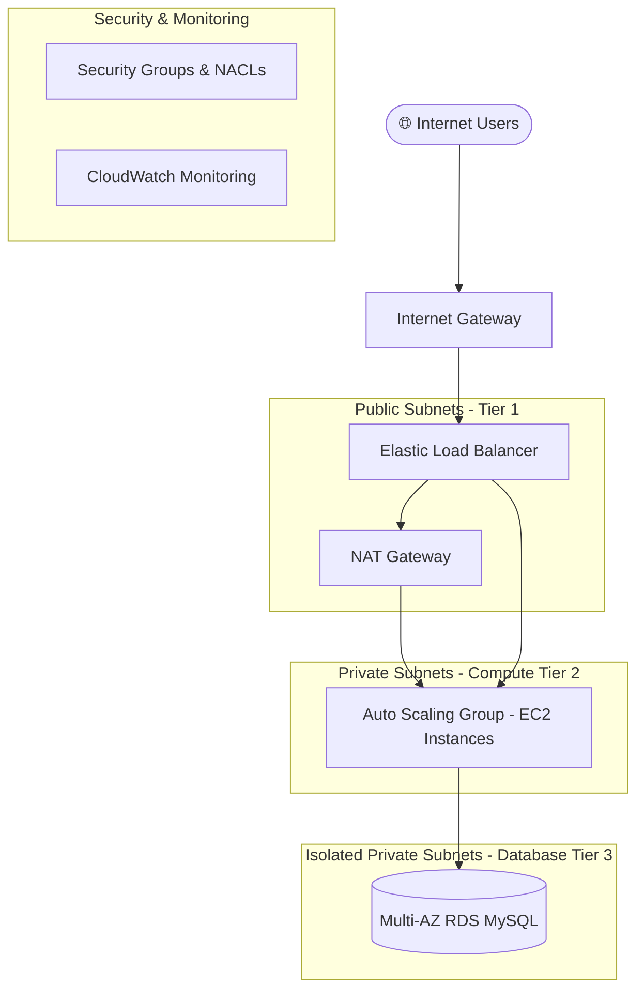

# ☁️ Production-Grade AWS 3-Tier Web Architecture (Terraform)

[](https://github.com/someshtarra/someshtarra/actions)


Modular, production-ready Infrastructure as Code (IaC) written in Terraform for deploying a highly available, secure, and auto-scaling 3-Tier Web Architecture on Amazon Web Services (AWS).

---

## 📐 Architecture Overview



---

## 🛠 Features & Module Highlights

- **VPC Module**: Custom VPC with Multi-AZ Public, Private Compute, and Isolated Database Subnets.
- **Compute Module**: Auto Scaling Group (ASG) behind an Application Load Balancer (ALB) with health checks.
- **Database Module**: Multi-AZ Amazon RDS MySQL instance deployed across isolated private database subnets.
- **Security Module**: Layered Security Groups restricting traffic flow (ALB -> EC2 -> RDS) following least privilege principles.
- **Automation**: CI/CD integration with GitHub Actions for automated linting, validation, and plan checks.

---

## 🚀 Quick Start & Usage

### Prerequisites
- [Terraform CLI](https://www.terraform.io/downloads.html) (>= 1.5.0)
- [AWS CLI](https://aws.amazon.com/cli/) configured with valid IAM credentials.

### Deploying Infrastructure

```bash
# Clone the repository
git clone https://github.com/someshtarra/someshtarra.git
cd someshtarra/aws-terraform-3tier-architecture

# Initialize Terraform modules
terraform init

# Validate configuration syntax
terraform validate

# Review execution plan
terraform plan

# Apply infrastructure deployment
terraform apply -auto-approve
```

---

## ⚙️ Module Customization (`terraform.tfvars`)

Copy `terraform.tfvars.example` to `terraform.tfvars` and customize your infrastructure settings:

```hcl
aws_region   = "us-east-1"
vpc_cidr     = "10.0.0.0/16"
environment  = "production"
db_name      = "app_db"
db_user      = "admin_user"
```

---

## 📄 License
This project is open-source and available under the [MIT License](LICENSE).
